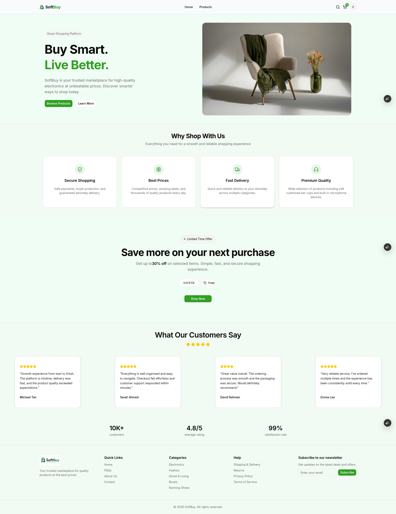
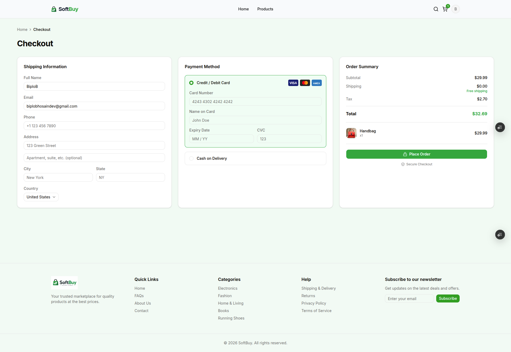
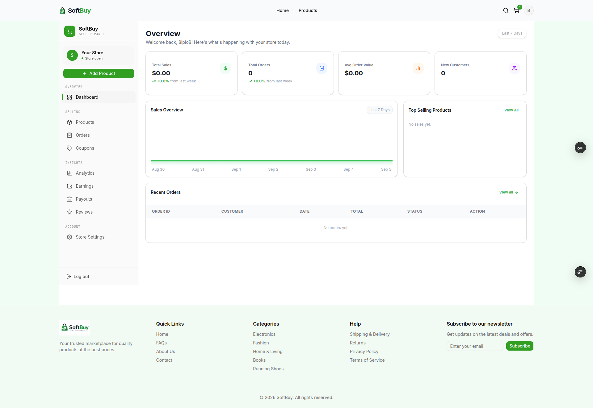
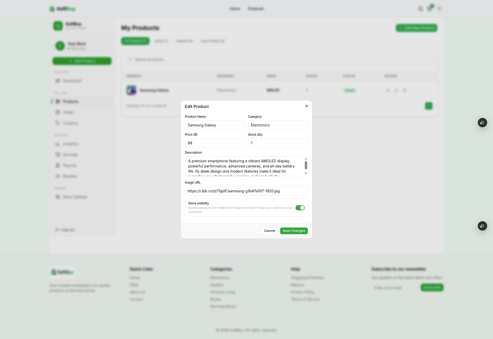
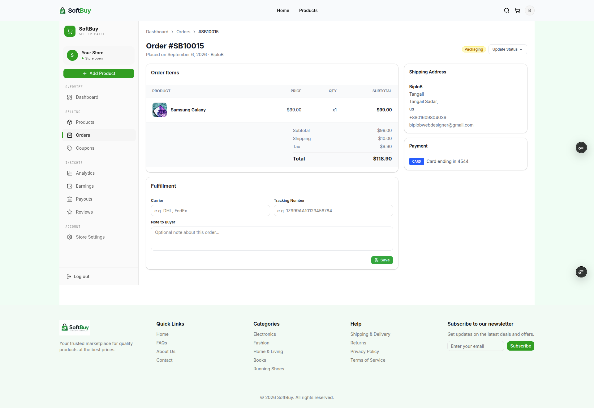

<div align="center">


# SoftBuy

A full-stack, two-sided e-commerce marketplace — buyer storefront and seller dashboard in one codebase — built with the Next.js App Router, MongoDB, and NextAuth.

**Live:** https://soft-buy.vercel.app &nbsp;·&nbsp; **Author:** Biplob — [GitHub](https://github.com/Amibiplob) · [Portfolio](https://amibiplob.vercel.app) · [LinkedIn](https://linkedin.com/in/amibiplob)

[](https://nextjs.org/)
[](https://react.dev/)
[](https://www.typescriptlang.org/)
[](https://www.mongodb.com/)
[](https://tailwindcss.com/)
[](https://next-auth.js.org/)

</div>

---

## Overview

SoftBuy is a marketplace where every account can shop, and any account can become a seller and run a storefront — list products, manage inventory, fulfill orders, run coupons, and track earnings — without a separate admin approving it.

It's built the way a real marketplace has to be: stock is reserved atomically so two buyers can't oversell the same unit, prices are recalculated server-side at checkout so a tampered client request can't change what gets charged, and every order moves through an explicit, centrally-defined status machine instead of a free-text field.

## Highlights

- **Two roles, one codebase** — a `buyer`/`seller` role on the user model gates access; any buyer can upgrade to seller from their account settings.
- **Race-safe checkout** — stock is decremented with an atomic, conditional MongoDB update (`stock: { $gte: qty }` in the filter), so concurrent orders can't push inventory negative. If any item in the cart fails to reserve, everything already reserved for that order is rolled back.
- **Server never trusts the client** — item prices, names, and images are re-read from the database at order time; only `productId` and `quantity` come from the client.
- **Explicit order lifecycle** — `Pending → Confirmed → Packaging → On the Way → Delivered`, with `Out of Stock` and `Cancelled` branches, enforced by a single state-transition table (`lib/orderStatus.ts`) so the UI can never push an order into an invalid state.
- **Seller tooling that's actually wired up** — products, orders, coupons, reviews, payouts, earnings, and analytics all read/write MongoDB directly (no mock data).

## Screenshots

| Homepage | Product Detail | Checkout |
| --- | --- | --- |
|  |  |  |

| Seller Dashboard | Edit Product | Order Management |
| --- | --- | --- |
|  |  |  |

## Features

**Storefront (buyer)**
- Product browsing with category and search filters, cart, and wishlist
- Full checkout flow — shipping details, Cash on Delivery / Card / PayPal selection, server-computed subtotal + tax + shipping
- Order history and detail pages with live status and tracking info
- Account settings, saved addresses, saved payment methods, product reviews

**Seller Dashboard**
- Product CRUD — price, stock, description, image, category, active/inactive visibility — with per-seller ownership checks on every write
- Order management — status updates constrained by the transition table, tracking number/carrier, internal notes, automatic stock restock on cancellation
- Coupons (percentage, fixed, or free-shipping) with usage limits and expiry
- Earnings & payouts — balance, available vs. pending funds, and payout account management, computed from live order data via MongoDB aggregation
- Analytics — sales trend and category breakdown charts
- Store settings and customer reviews

**Platform-wide**
- Credentials-based auth via NextAuth (JWT sessions, bcrypt-hashed passwords)
- Forgot/reset password flow with transactional email (Resend)
- Human-readable, atomically-generated order IDs (`SB10011`, `SB10012`, …) via a MongoDB counter document

## Tech Stack

| Layer         | Technology                                                                |
| ------------- | -------------------------------------------------------------------------- |
| Framework     | Next.js 16 (App Router)                                                    |
| UI            | React 19, Tailwind CSS v4, shadcn/ui, Radix UI                             |
| Language      | TypeScript                                                                  |
| Database      | MongoDB (native driver, no ORM)                                            |
| Auth          | NextAuth v4 — Credentials provider, JWT sessions, bcrypt password hashing  |
| Icons         | lucide-react, react-icons                                                  |
| Email         | Resend (transactional — password reset)                                   |
| Notifications | Sonner (toasts)                                                            |
| Package mgr   | pnpm                                                                        |

## Project Structure

```
Soft-Buy/
├─ app/
│  ├─ (auth)/            # login, register, forgot/reset password
│  ├─ (shop)/            # cart, checkout, products, category pages
│  ├─ dashboard/         # buyer account: orders, addresses, payment methods, wishlist
│  ├─ seller-dashboard/  # seller-facing: products, orders, coupons, earnings, payouts, analytics
│  ├─ api/
│  │  ├─ auth/            # NextAuth handler, register, forgot/reset password
│  │  ├─ orders/          # place order, list orders, order detail (buyer-facing)
│  │  ├─ products/        # public product listing + detail
│  │  ├─ wishlist/        # wishlist add/remove
│  │  ├─ addresses/       # address CRUD + default address
│  │  ├─ payment-methods/ # payment method CRUD + default card
│  │  ├─ account/         # profile, password, become-seller, notification settings
│  │  └─ seller/          # seller-only: products, orders, coupons, earnings, payouts, analytics, reviews, store
│  └─ page.tsx            # homepage
├─ components/
│  ├─ layout/             # Navbar, Footer, MobileMenu, NavAuthSection
│  ├─ home/               # Banner, Features, Discount, Reviews
│  └─ ui/                 # shadcn/ui primitives
├─ context/                # CartContext, WishlistContext
├─ lib/
│  ├─ db.ts                # MongoDB client singleton
│  ├─ auth.ts               # NextAuth authOptions (Credentials + JWT callbacks)
│  ├─ orderStatus.ts        # Order status enum, allowed transitions, badge styles
│  ├─ requireSeller.ts       # Server-side seller-role guard for /api/seller/* routes
│  └─ sellerBalance.ts       # Earnings/payout aggregation helpers
└─ types/                   # Shared TypeScript interfaces
```

## Getting Started

**Prerequisites:** Node.js 20+, [pnpm](https://pnpm.io/), a MongoDB database (e.g. [MongoDB Atlas](https://www.mongodb.com/atlas)), a [Resend](https://resend.com/) API key.

```bash
git clone https://github.com/Amibiplob/Soft-Buy.git
cd Soft-Buy
pnpm install
```

Create `.env.local`:

```
MONGODB_URI=your_mongodb_connection_string
NEXTAUTH_SECRET=your_random_secret
NEXTAUTH_URL=http://localhost:3000
RESEND_API_KEY=your_resend_api_key
EMAIL_FROM=noreply@yourdomain.com
```

```bash
pnpm dev     # http://localhost:3000
pnpm build   # production build
pnpm start   # run production build
pnpm lint    # ESLint
```

## Roadmap

- [ ] Real payment gateway (Stripe/PayPal) — checkout currently captures a payment method and, for cards, only the last 4 digits; no live processor is wired in yet
- [ ] `next/image` for product/order photos — currently plain `` since images come from arbitrary seller-supplied URLs rather than a fixed set of allowed hosts
- [ ] Automated test coverage (unit + integration)

## License

No license file yet — all rights reserved by the author unless stated otherwise.